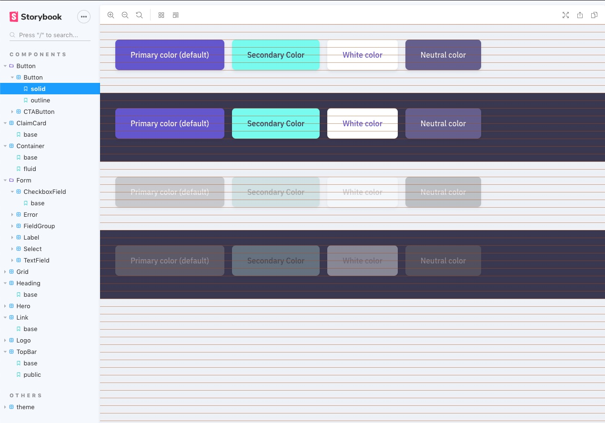

[![Last Commit][last-commit-badge]][last-commit]
[![Travis][build-badge]][build]
[![npm package][npm-badge]][npm]

[last-commit-badge]: https://img.shields.io/github/last-commit/jmlweb/storybook-vrhythm.svg
[last-commit]: https://github.com/jmlweb/storybook-vrhythm
[build-badge]: https://img.shields.io/travis/jmlweb/storybook-vrhythm/master.png?style=flat-square
[build]: https://travis-ci.org/jmlweb/storybook-vrhythm
[npm-badge]: https://img.shields.io/npm/v/storybook-vrhythm.png?style=flat-square
[npm]: https://www.npmjs.org/package/storybook-vrhythm

# Storybook Vertical Rhythm Decorator

Take an eye over the vertical rhythm of your stories with this decorator.

It should work with any framework/library, however it's only tested in a React environment for the moment.



## Installation

`npm install storybook-vrhythm --development`

or

`yarn add -D storybook-rhythm`

## Using the decorator globally

```js
import { addDecorator, addParameters } from '@storybook/react'; // or Vue, Angular...
import StorybookVRhythm from 'storybook-vrhythm';

addDecorator(StorybookVRhythm);

addParameters({
  vrhythm: {
    color: 'rgba(178,86,18,0.5)',
    lineHeight: '16px',
    offset: 0,
  },
});
```

## Using the decorator in your stories

```jsx
const stories = storiesOf('components|MyComponent', module);

stories.addParameters({ vrhythm: { hide: true } });
```

## Available options

### color

Any valid color for the lines (examples: #ff0000, rgba(0,0,0,0.3))

default: `'rgb(204, 204, 204)'`

### lineHeight

Any valid value for the lineHeight of your system (examples: 16px, 1rem...)

default: `16px`

### offset

The offset from the top, in case your component is wrapped or whatever.

default: `0`

### hide

Useful to hide the decorator in some stories

default: `false`

## Inspiration

[Baseliner extension](https://jpedroribeiro.com/2015/08/baseliner-my-first-chrome-extension/)
